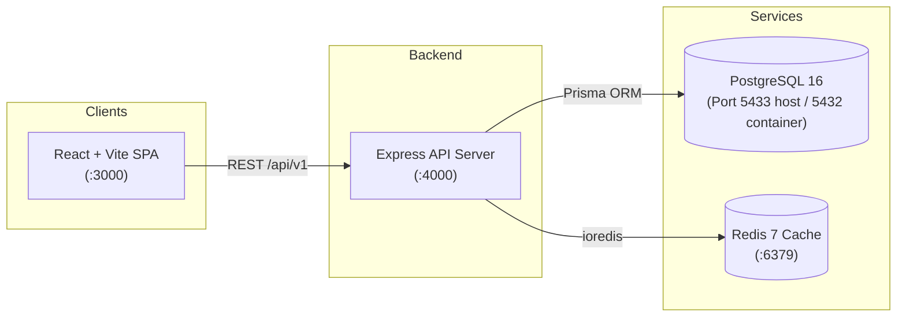

# OrgSphere — Organization Management System

## Status
**Implementation complete; database and Compose runtime verification pending**

OrgSphere is an enterprise-grade multi-organization workspace application built with Node.js, Express, TypeScript, React, PostgreSQL (Prisma ORM), Redis, and Docker.

---

## Architecture Overview



Detailed design and specification documents are located in [`docs/`](./docs/):
- [`docs/architecture.md`](./docs/architecture.md) — System diagram, module responsibilities, request lifecycle, tenant boundaries.
- [`docs/api-contract.md`](./docs/api-contract.md) — REST conventions, standard envelopes, status codes, dependency policies.
- [`docs/database-design.md`](./docs/database-design.md) — Complete ER diagram covering all 11 entities, composite foreign keys, indexing strategy.
- [`docs/security.md`](./docs/security.md) — Password hashing, JWT access/rotating refresh tokens, RBAC matrix, AES-256-GCM encryption.
- [`docs/implementation-plan.md`](./docs/implementation-plan.md) — Phase-by-phase completion roadmap and acceptance criteria.

---

## Tech Stack

| Layer | Technology | Role |
|---|---|---|
| **Frontend** | React, Vite, TypeScript, Tailwind CSS | Single-page application (`apps/web`) |
| **Backend** | Node.js, Express, TypeScript | REST API (`apps/api`) |
| **Database** | PostgreSQL 16, Prisma ORM | Relational multi-tenant persistence with composite constraints |
| **Cache** | Redis 7 (`ioredis`) | Cache-aside for metrics and read-heavy lookups |
| **Validation** | Zod | Request payload, query, and environment validation |
| **Observability** | Pino, OpenTelemetry (HTTP OTLP) | Structured logging with correlation IDs & distributed tracing |
| **Documentation** | Swagger UI / OpenAPI 3.0 | Interactive API contract served at `/api/v1/docs` |
| **Containers** | Docker, Docker Compose | Multi-container orchestration |

---

## Database Entities (11 Entities)

1. **User** — System users with encrypted PII fields and password hashes.
2. **Organization** — Multi-tenant organization boundaries.
3. **OrganizationMembership** — Binds User + Organization + Role.
4. **Role** — System and organization-level roles.
5. **Permission** — Granular action permissions.
6. **RolePermission** — Join table mapping permissions to roles.
7. **Department** — Department organizational units within a tenant.
8. **Project** — Projects with department ownership and member leads.
9. **Task** — Tasks with project containment and member assignees.
10. **RefreshToken** — Cryptographically hashed rotating refresh tokens.
11. **AuditLog** — Immutable audit trail with actor, action, tenant, IP, and request ID.

### Multi-Tenant Integrity Guarantees
Cross-tenant leakage is prevented at the database engine level using composite foreign keys:
- Projects can only reference Departments in the same organization: `(departmentId, organizationId) -> Department(id, organizationId)`.
- Project owners must belong to the same organization: `(ownerId, organizationId) -> OrganizationMembership(userId, organizationId)`.
- Tasks can only belong to Projects in the same organization: `(projectId, organizationId) -> Project(id, organizationId)`.
- Task assignees must belong to the same organization: `(assigneeId, organizationId) -> OrganizationMembership(userId, organizationId)`.

---

## Local Setup & Development

### 1. Prerequisites
- **Node.js** (v20+ recommended; v24 tested)
- **npm** (v10+; v11 tested)
- **Docker & Docker Compose** (for containerized PostgreSQL and Redis)

### 2. Environment Configuration
Copy the template to `.env`:
```bash
cp .env.example .env
```

#### Port Assignment & Database Notes:
- **Docker Compose PostgreSQL**: Bound to host port `5433` (e.g. `localhost:5433`) to prevent collision with any existing local PostgreSQL service running on port `5432`.
- **Existing Local PostgreSQL**: If using an existing local PostgreSQL service on port `5432`, create a dedicated database named `orgsphere_dev` to keep existing databases completely untouched, and configure `DATABASE_URL` in `.env`.
- **Container Network**: Inside Docker containers, the API connects to `postgres:5432` using Docker internal DNS.

### 3. Install Dependencies
From `Project 2/organization-management-system`:
```bash
npm install
```

### 4. Database Setup & Prisma
```bash
# Validate schema
npm run prisma:validate

# Generate Prisma client
npm run prisma:generate

# Apply migrations
npm run prisma:migrate
```

### 5. Running the Application
- **Start All Services with Docker**:
  ```bash
  docker compose up -d
  ```
- **Run API in Local Development Mode**:
  ```bash
  npm run dev:api
  ```
- **Run Frontend in Local Development Mode**:
  ```bash
  npm run dev:web
  ```

---

## Available Monorepo Scripts

| Command | Action |
|---|---|
| `npm run typecheck` | Run TypeScript compiler checks across all workspaces (`tsc --noEmit`). |
| `npm run test` | Run test suites across all workspaces. |
| `npm run dev:api` | Start the Express API development server with live reload. |
| `npm run dev:web` | Start the Vite React development server. |
| `npm run prisma:generate` | Generate the Prisma client. |
| `npm run prisma:validate` | Validate `schema.prisma` syntax and relation constraints. |
| `npm run docker:up` | Start PostgreSQL, Redis, API, and Web via Docker Compose. |
| `npm run docker:down` | Stop and remove Docker Compose containers. |

---

## Phase 1 Foundation Endpoints

Once the API server is running, the following endpoints are available:

- `GET http://localhost:4000/api/v1/health` — System liveness check.
- `GET http://localhost:4000/api/v1/ready` — Readiness probe (PostgreSQL hard dependency, Redis optional cache status).
- `GET http://localhost:4000/api/v1/version` — Service and version payload.
- `GET http://localhost:4000/api/v1/docs` — Interactive Swagger UI documentation.
- `GET http://localhost:4000/api/v1/docs/openapi.json` — Raw OpenAPI 3.0 specification.
