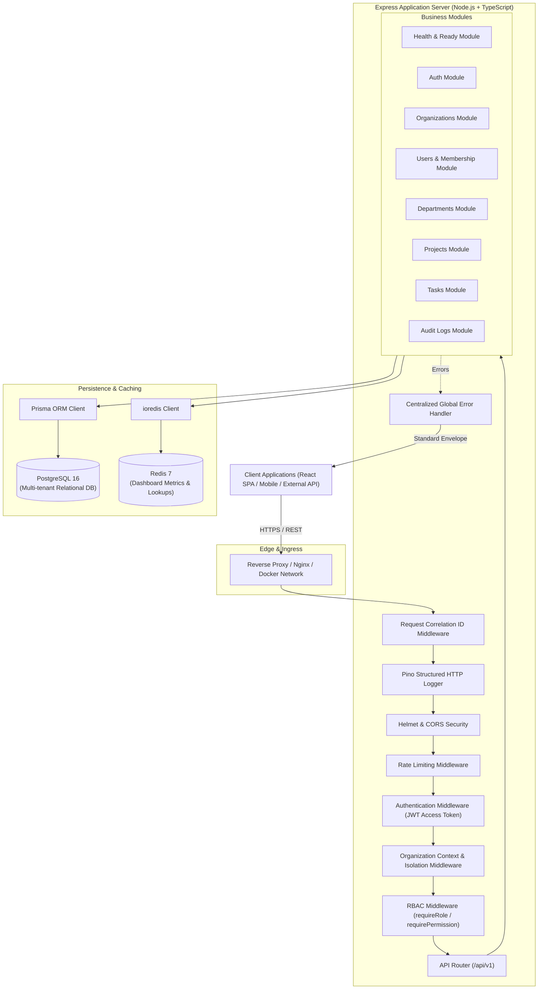
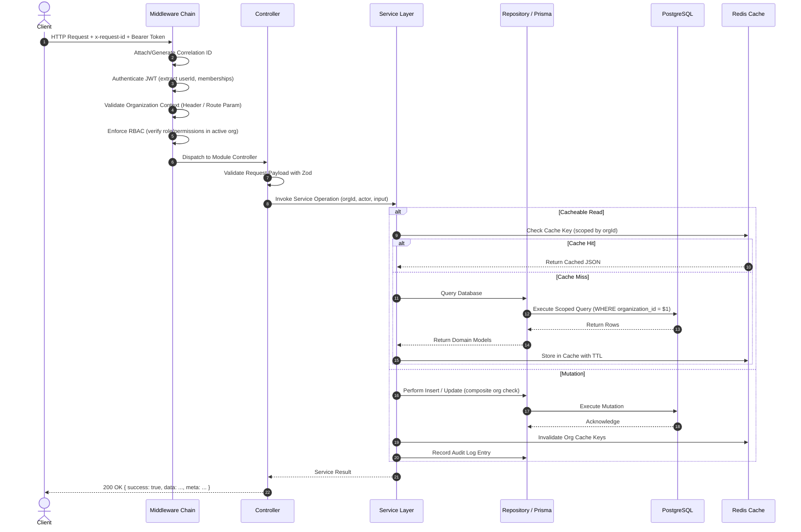

# OrgSphere Architecture & System Design

## 1. System Overview
OrgSphere is a secure multi-organization workspace application designed for managing organizations, departments, employees, projects, tasks, and audit logs with strict role-based access control (RBAC).

---

## 2. Module Responsibilities

| Module | Core Responsibility |
|---|---|
| **Health & Readiness** | System liveness (`/health`), readiness dependency probes (`/ready`), and version info (`/version`). |
| **Auth** | User registration, login, logout, refresh token rotation, password change/reset. |
| **Organizations** | Multi-organization lifecycle, tenant settings, active organization selection. |
| **Users & Memberships** | User profile management, organization memberships, and role assignments. |
| **Departments** | Department hierarchies and organizational resource grouping. |
| **Projects** | Project tracking, status workflows, and department ownership. |
| **Tasks** | Task assignments, status, priority, due dates, and employee task updates. |
| **Audit Logs** | Immutable, append-only security logs capturing actor, action, tenant, IP, and correlation ID. |

---

## 3. Request Lifecycle

---

## 4. Cross-Organization Boundary Enforcement

Data security between organizations is guaranteed at two distinct layers:

### A. Database-Enforced Composite Foreign Keys
The PostgreSQL schema uses composite unique constraints and composite foreign keys to guarantee relational integrity across organizational boundaries:
- `Department` has `@@unique([id, organizationId])`.
- `Project` references `Department` via composite foreign key `(departmentId, organizationId) -> Department(id, organizationId)`. This makes it **physically impossible** for a project in Organization A to be assigned to a department in Organization B.
- `Project` has `@@unique([id, organizationId])`.
- `Task` references `Project` via composite foreign key `(projectId, organizationId) -> Project(id, organizationId)`. This makes it **physically impossible** for a task in Organization A to belong to a project in Organization B.
- `Task` references `OrganizationMembership` via composite foreign key `(assigneeId, organizationId) -> OrganizationMembership(userId, organizationId)`. An assignee must be a verified member of that exact organization.

### B. Service-Layer Ownership & Organization Scoping
- Every data access repository explicitly injects `where: { organizationId }` into queries.
- Before updating or deleting entities, services verify entity existence strictly within the requesting tenant context.
- Cross-organization access attempts return `404 Not Found` (to prevent tenant enumeration attacks) or `403 Forbidden` according to security policy.
