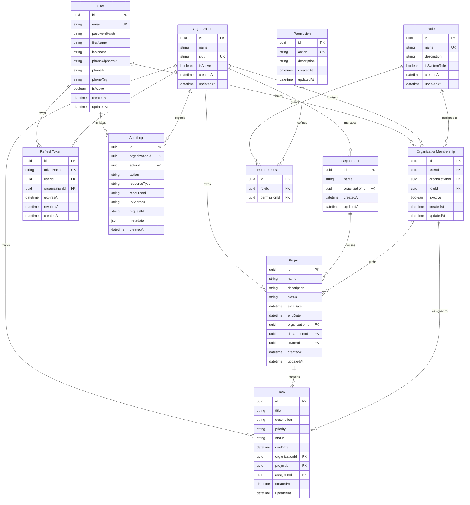

# OrgSphere Database Design & Entity Relationships

## 1. Entity-Relationship Diagram (11 Entities)



---

## 2. Multi-Tenant Integrity & Composite Foreign Keys

To guarantee that entities from one organization cannot accidentally link to another organization's records, PostgreSQL composite foreign keys enforce organization isolation directly at the database engine level:

### Enforced at Database Engine Level
1. **Department Isolation**:
   - `Department` has `@@unique([id, organizationId])`.
   - `Project` references `(departmentId, organizationId)` pointing to `Department(id, organizationId)`.
   - *Result*: A project in Org A cannot reference a department in Org B; PostgreSQL raises a foreign key violation `23503`.
2. **Project Isolation**:
   - `Project` has `@@unique([id, organizationId])`.
   - `Task` references `(projectId, organizationId)` pointing to `Project(id, organizationId)`.
   - *Result*: A task in Org A cannot be assigned to a project in Org B.
3. **Membership Ownership & Assignment Isolation**:
   - `OrganizationMembership` has `@@unique([userId, organizationId])`.
   - `Project` references `(ownerId, organizationId)` pointing to `OrganizationMembership(userId, organizationId)`.
   - `Task` references `(assigneeId, organizationId)` pointing to `OrganizationMembership(userId, organizationId)`.
   - *Result*: When non-null, an assignee or project owner must belong to that specific organization.
4. **Refresh Token Tenant Binding**:
   - `RefreshToken` references `(userId, organizationId)` pointing to `OrganizationMembership(userId, organizationId)` with `ON DELETE CASCADE`.
   - *Result*: A refresh token can only be issued for a user who holds an active membership in that organization. If the membership is deleted, the token is automatically purged.
5. **Audit Log Retention Policy (`ON DELETE RESTRICT`)**:
   - `AuditLog` references `Organization(id)` with `ON DELETE RESTRICT`.
   - *Result*: Protects audit logs from being removed by deleting their parent organization while referencing logs exist; PostgreSQL rejects hard-deletion attempts with a foreign key violation (`P2003`). Organizations must instead be deactivated via soft-delete (`isActive = false`) to retain historical audit rows. (Note: database constraints protect against cascading parent deletions; append-only enforcement and log immutability are handled separately by service-layer access controls).

### Nullable Composite Foreign Keys Semantics
- Under PostgreSQL default foreign key rules (`MATCH SIMPLE`), if a nullable component (`departmentId`, `ownerId`, or `assigneeId`) is `NULL`, the constraint is satisfied.
- This accurately models optional relationships: a project may be created before a department is assigned, and a task may initially be unassigned.
- **Guarantee**: Whenever `departmentId`, `ownerId`, or `assigneeId` is non-null, PostgreSQL strictly enforces that the referenced entity shares the exact same `organizationId`.

### Enforced at Service Layer
- Application service layer queries inject `where: { organizationId }` on all operations.
- Route authorization verifies the user's active membership in the requested organization before processing requests.
- Soft non-enumeration policy: If a resource belongs to another organization, return `404 Not Found` rather than revealing its existence.

---

## 3. Indexing Strategy

Indexes are designed following the **leading-column rule** to optimize multi-tenant queries:

| Table | Index Columns | Supported Query Patterns |
|---|---|---|
| `OrganizationMembership` | `[userId, organizationId]` (Unique) | User tenant lookup, membership verification |
| `OrganizationMembership` | `[organizationId, roleId]` | List members filtered by role within an org |
| `Department` | `[organizationId, name]` (Unique) | Prevent duplicate department names within an org |
| `Project` | `[organizationId, status]` | Org project listing filtered by status |
| `Project` | `[organizationId, createdAt]` | Chronological project pagination |
| `Project` | `[departmentId]` | Projects in department lookup |
| `Task` | `[organizationId, status]` | Filter tasks by status within an org |
| `Task` | `[projectId, status]` | Task board / Kanban view within a project |
| `Task` | `[assigneeId, status]` | My assigned tasks list |
| `Task` | `[organizationId, dueDate]` | Overdue task calculations |
| `AuditLog` | `[organizationId, createdAt]` | Chronological audit log pagination |
| `AuditLog` | `[organizationId, action]` | Audit filtering by event type |
| `RefreshToken` | `[userId, organizationId]` | Token revocation on logout / password reset |

---

## 4. Container Initialization vs. Migration Lifecycle

> [!IMPORTANT]
> **Container Initialization Note**:
> PostgreSQL container initialization scripts located in `infra/postgres-init/` execute **only once**, during the initial creation of an empty database volume.
> If the data directory already contains initialized database files, these scripts are skipped by PostgreSQL.
>
> All subsequent schema modifications and evolutions **must be executed via Prisma migrations**:
> ```bash
> npx prisma migrate dev --name <migration_name>
> ```
